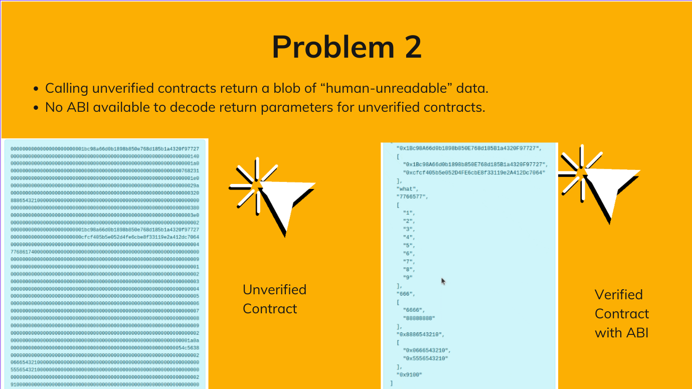
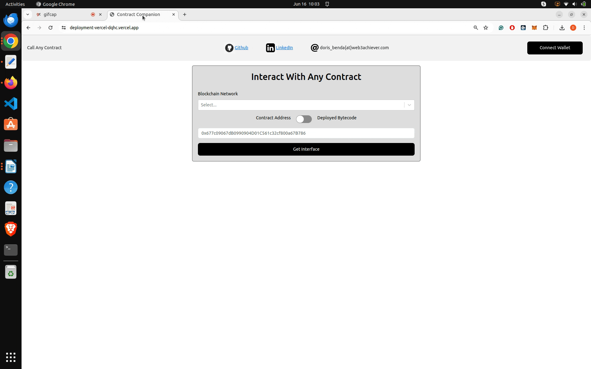
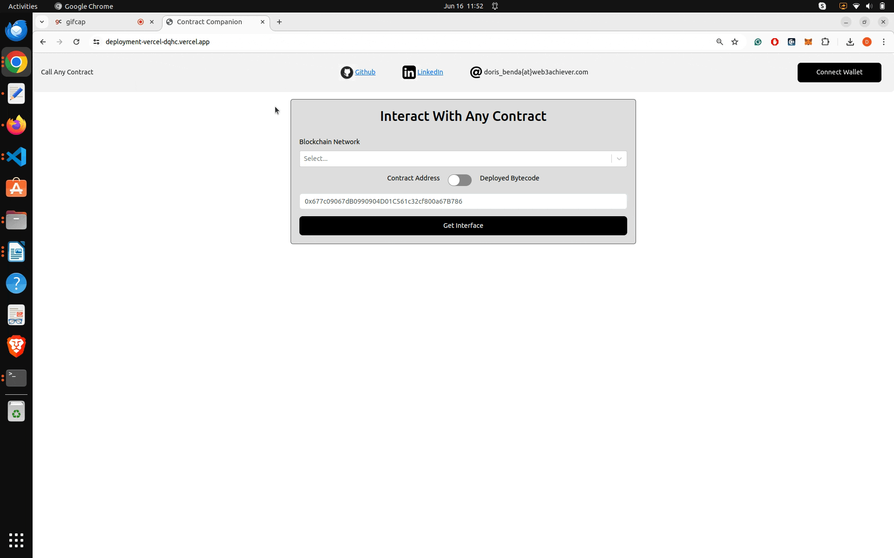
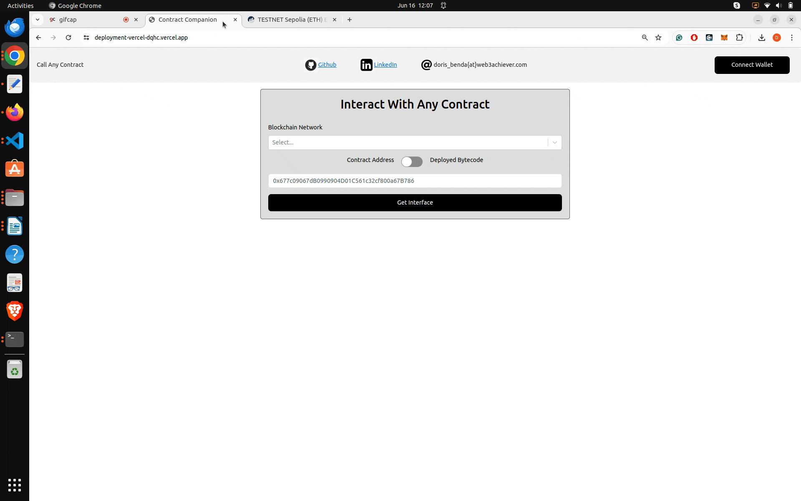

# ContractCompanion

> **IMPORTANT:** Reverse-engineering the ABI from raw bytecode relies on heuristics and
> may not be fully reliable. Without access to the source code or other methods
> to verify the results, avoid using the front-end to execute transactions on mainnet
> that could lead to potential loss of funds.

## Hosted Front End

[Live Front End](https://deployment-vercel-dqhc.vercel.app/)

## Problems




## Solution/ How ContractCompanion Works

ContractCompanion utilizes `evMole` to address problem 1 and `abi-guesser` for problem 2. It offers an intuitive front-end interface
for interacting with any contract on an EVM-based blockchain, enabling both reading and writing operations.
You don’t need access to the ABI or source code — just provide the contract address or raw bytecode.

Note: The front-end supports browser wallets (no mobile wallets).

The technical details are:

The front-end extracts the function selectors and the input parameter types from the EVM bytecode, even for unverified contracts. If a signature is recognized (e.g., through lookups in the [database](https://docs.openchain.xyz/)), it displays the corresponding human-readable function names. Additionally, when reading data from a contract, the front-end analyzes the returned raw bytes to decode and present return parameters in a structured, human-readable format.

## EVM Bytecode Analyzers (Solutions for Problem 1)

This section summarizes projects that are interesting to check out for a deep dive into EVM bytecode analysis.

- [Evmole](https://github.com/cdump/evmole)
- [Heimdall](https://github.com/Jon-Becker/heimdall-rs)
- [Whatsabi](https://github.com/shazow/whatsabi)
- [EVM_Opcodes](https://www.evm.codes/)
- [EVM_Playground](https://www.evm.codes/playground?fork=shanghai)
- [Panoramix](https://github.com/palkeo/panoramix)
- [Symbolic EVM](https://github.com/acuarica/evm)
- [EtherVM](https://ethervm.io/decompile)

## ABI-encoded Data Analyzers (Solutions for Problem 2)

This section summarizes projects that are interesting to check out for decoding ABI-encoded blob data (such as calldata, and return values)

- [OpenChain](https://github.com/openchainxyz/abi-guesser)
- [Heimdall](https://github.com/Jon-Becker/heimdall-rs/tree/main/crates/decode)

## Next Milestones

- Create issue/PR on `BlockScout` repo -> Integrate into `BlockScout`.

- Talk to `EtherScan` people -> Experimental integration into `EtherScan`.

- REMIX IDE -> [Proof-Of-Concept-Integration](https://github.com/DOBEN/remix-project) -> Get response from REMIX team?

## Who Benefits from ContractCompanion

- Security Researchers:
  - Simplifies the analysis of smart contracts deployed by malicious actors.
  - Enables quicker response to smart contract vulnerabilities or hacks.
- Open-source Advocates:
  - Reinforces the open-source ethos.
  - Makes it easier to bypass attempts by companies to close-source their smart contracts for a competitive advantage.
- Smart Contract Developers:
  - Facilitates the maintenance of unverified legacy smart contract protocols.

## Exploring On-Chain Bytecode Diversity

While Solidity remains the predominant language for deployed contracts, the Ethereum Virtual Machine (EVM) bytecode landscape is quite diverse. Beyond Solidity, I encounter a variety of origins for on-chain bytecode, spanning different languages, frameworks, and even raw bytecode optimizations. Here is a collection of interesting bytecode origins:

- _Solidity_: The familiar and widely-used language for smart contract development.
- _Vyper_: An alternative smart contract language.
  (e.g. [Curve protocol](https://curve.readthedocs.io/ref-addresses.html)).
- _Yul_: An intermediate language for Ethereum smart contracts, offering low-level control and optimization capabilities.
- _Raw bytecode_
  - e.g. [MIMC_sponge hash function contract](https://etherscan.io/address/0x83584f83f26af4edda9cbe8c730bc87c364b28fe#code). It contains the implementation of the zk-friendly hash function of the Tornado cash protocol.
  - e.g. [Huff contract](https://sepolia.etherscan.io/address/0x2e98D76982FB23a4c669bF4eBBeA8f7aDEaB76b5). It was written using the [Huff language](https://docs.huff.sh/).

## Examples

Summary of recordings showcasing the capabilities of the `ContractCompanion` tool.

### Example 1 (Loading the ABI interface from an address)

Without connecting a wallet, you can derive the ABI interface from an address (or from its deployed bytecode)
from a predefined network (e.g. EthereumMainnet or SepoliaTestnet).

The recording shows the loading of the UNISWAP factory (0xB7f907f7A9eBC822a80BD25E224be42Ce0A698A0) interface on Sepolia.
After connecting the wallet, the number of pairs, and the address of the first pair are read from the factory. The input parameter types and the return parameter types are decoded by the tool based on the deployed EVM bytecode on-chain.


### Example 2 (Loading the ABI interface from deployed bytecode)

Without connecting a wallet, you can derive the ABI interface from deployed bytecode for any other EVM network.

The recording shows the loading of a `Counter` smart contract interface on Amoy given the deployed bytecode.
After connecting the wallet, the counter value is incremented and read from the contract state.


### Example 3 (Proxy-Implementation Pattern)

The recording shows the loading of a proxy-implementation pattern (`Counter` smart contract) on Sepolia. The counter value is incremented and read from the contract state.



### Example 4 (Writing to chain with `value` and `gasLimit`)

The recording shows how to send ETH when writing to the chain and how to set the `gasLimit`.



### Example 5 (Reading from chain)

The recording shows the decoding of the return parameter from a complex smart contract.



### Example 6 (Reading from chain by fine-tuning the inferred types)

The recording shows how the decoding of the return parameter can be manually fine-tuned.


## Commands

- Clone the repo:

```
git clone https://github.com/DOBEN/ContractCompanion.git
```

- Set up `EtherScan API` key:

Rename `.env_example` file to `.env` and insert your [EtherScan API key](https://docs.etherscan.io/getting-started/viewing-api-usage-statistics)

- Run `yarn` to install dependencies in the root folder of this project:

```
yarn
```

- Run `yarn build` to build the front end:

```
yarn build
```

- Run `yarn dev` to run the front end locally:

```
yarn dev
```

- Run `yarn fmt` to run prettier:

```
yarn fmt
```

- Run `yarn lint` to run the linter:

```
yarn lint
```
