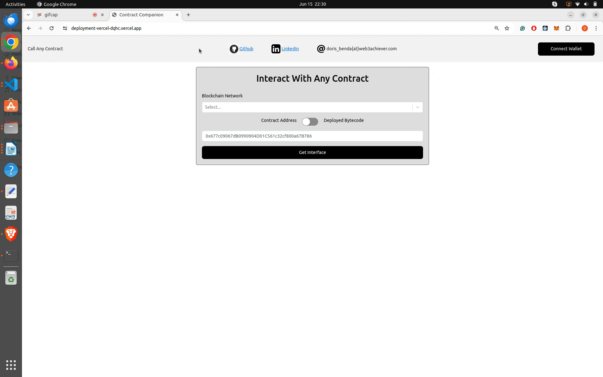

# Contract Companion

[Live Front End](https://deployment-vercel-dqhc.vercel.app/)

## How It Works

You can use the front to interact with any contract on an EVM blockchain network - reading and writing. You don't need to have access to the ABI or source code to do so just provide the contract address or raw bytecode.
The front end extracts function selectors and input parameter types from the Ethereum Virtual Machine (EVM) bytecode, even for unverified contracts. If the signature is known (e.g. via lookups in the [database](https://docs.openchain.xyz/)), it even displays the matching human-readable names of the functions. In addition, the front end decodes the return parameter types when reading data from a smart contract by analyzing the returned raw bytes.
The front end can then display the return parameter in a structural human-readable manner.

## Commands

- Clone the repo:

```
git clone https://github.com/DOBEN/ContractCompanion.git
```

- Run `yarn` to install dependencies in the root folder of this project:

```
yarn
```

- Run `yarn build` to build the front end:

```
yarn build
```

- Run `yarn dev` to run the front end locally:

```
yarn dev
```

- Run `yarn fmt` to run prettier:

```
yarn fmt
```

- Run `yarn lint` to run the linter:

```
yarn lint
```

## EVM Bytecode Analyzers

This section summarizes projects that are interesting to check out for a deep dive into EVM bytecode analysis.

- [Evmole](https://github.com/cdump/evmole)
- [Heimdall](https://github.com/Jon-Becker/heimdall-rs)
- [Whatsabi](https://github.com/shazow/whatsabi)
- [EVM_Opcodes](https://www.evm.codes/)
- [EVM_Playground](https://www.evm.codes/playground?fork=shanghai)
- [Panoramix](https://github.com/palkeo/panoramix)
- [Symbolic EVM](https://github.com/acuarica/evm)
- [EtherVM](https://ethervm.io/decompile)

## ABI-encoded Data Analyzers

This section summarizes projects that are interesting to check out for decoding ABI-encoded blob data (such as calldata, and return values)

- [OpenChain](https://github.com/openchainxyz/abi-guesser)
- [Heimdall](https://github.com/Jon-Becker/heimdall-rs/tree/main/crates/decode)

## Exploring On-Chain Bytecode Diversity

While Solidity remains the predominant language for deployed contracts, the Ethereum Virtual Machine (EVM) bytecode landscape is quite diverse. Beyond Solidity, I encounter a variety of origins for on-chain bytecode, spanning different languages, frameworks, and even raw bytecode optimizations. Here is a collection of interesting bytecode origins:

- _Solidity_: The familiar and widely-used language for smart contract development.
- _Vyper_: An alternative smart contract language.
  (e.g. [Curve protocol](https://curve.readthedocs.io/ref-addresses.html)).
- _Yul_: An intermediate language for Ethereum smart contracts, offering low-level control and optimization capabilities.
- _Raw bytecode_
  - e.g. [MIMC_sponge hash function contract](https://etherscan.io/address/0x83584f83f26af4edda9cbe8c730bc87c364b28fe#code). It contains the implementation of the zk-friendly hash function of the Tornado cash protocol.
  - e.g. [Huff contract](https://sepolia.etherscan.io/address/0x2e98D76982FB23a4c669bF4eBBeA8f7aDEaB76b5). It was written using the [Huff language](https://docs.huff.sh/).

## Examples

Summary of recordings showcasing the capabilities of the `ContractCompanion` tool.

### Example 1 (Loading the ABI interface from an address)

Without connecting a wallet, you can derive the ABI interface from an address (or from its deployed bytecode)
from a predefined network (e.g. EthereumMainnet or SepoliaTestnet).

The recording shows the loading of the UNISWAP factory (0xB7f907f7A9eBC822a80BD25E224be42Ce0A698A0) interface on Sepolia.
After connecting the wallet, the number of pairs, and the address of the first pair are read from the factory. The input parameter types and the return parameter types are decoded by the tool based on the deployed EVM bytecode on-chain.



### Example 2 (Loading the ABI interface from deployed bytecode)

Without connecting a wallet, you can derive the ABI interface from deployed bytecode for any other EVM network.

The recording shows the loading of a `Counter` smart contract interface on Amoy given the deployed bytecode.
After connecting the wallet, the counter value is incremented and read from the contract state.


### Example 3 (Proxy-Implementation Pattern)

The recording shows the loading of a proxy-implementation pattern (`Counter` smart contract) on Sepolia. The counter value is incremented and read from the contract state.


### Example 4 (Writing to chain with `value` and `gasLimit`)

The recording shows how to send ETH when writing to the chain and how to set the `gasLimit`.


### Example 5 (Reading from chain)

The recording shows the decoding of the return parameter from a complex smart contract.


### Example 6 (Reading from chain by fine-tuning the inferred types)

The recording shows how the decoding of the return parameter can be manually fine-tuned.


